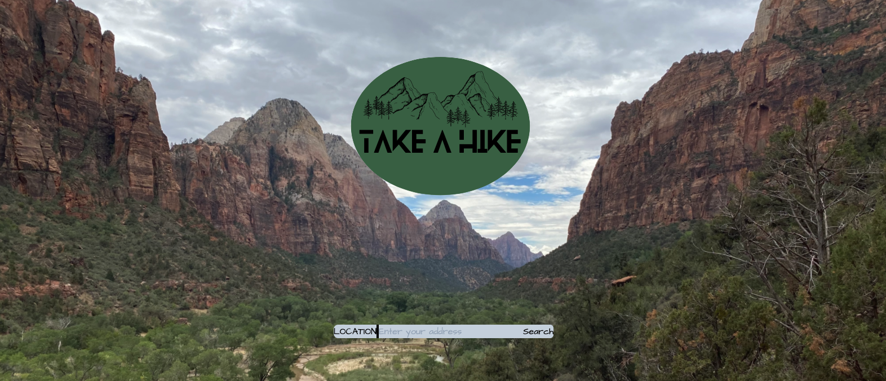

# Take a Hike

*An exploration into consuming hiking and weather APIs to build an interactive application for planning outdoor treks.*

## User Story

*As an outdoorsy person, I'd like to know the nearest hiking locations and the weather for those locations so I can effectively prepare for my journey.*

### Technologies Used

- HTML
- Javascript
- Tailwind CSS Framework
- Google (Maps API, Places Library, Geocoder API)
- Openweather API

[Take a Hike](https://amirb97.github.io/take-a-hike/)

[Presentation](https://docs.google.com/presentation/d/1tsNCTL9EaEm4sWFblhEPiNq1Gi5u49_YcF6NIm5iYUc/edit?usp=sharing)

Built by: Adam Burpee, Amir Bahmani, Alan Lin
